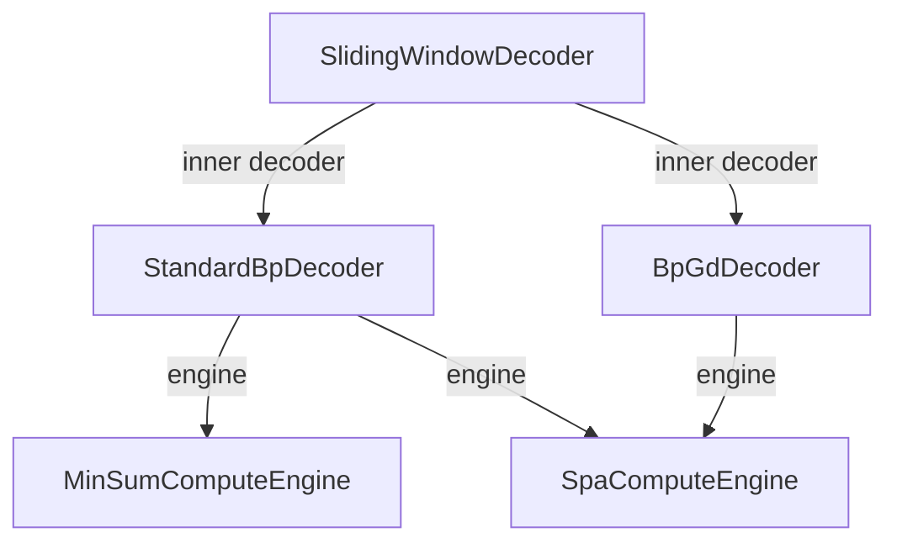

# qldpc-sliding-window-decoding

Rut implementations with Python bindings of a series of decoders for quantum
low-density parity-check (QLDPC) Codes, centered around sliding-window
decoding.

## Usage as Python package

```bash
$ pip install .
```

## Development

### Usage

- Set up environment
    - With conda (automatically installs python, rust, maturin):
        ```bash
        $ conda env create -f environment.yml
        $ conda activate rust-qldpc
        ```
    - With uv (requires manual installation of certain dependencies):
        ```bash
        $ uv venv --python 3.12
        $ . .venv/bin/activate
        $ uv pip install quits
        ```
- Run unit tests
    ```bash
    $ export LD_LIBRARY_PATH=$(python -c "import sysconfig; print(sysconfig.get_config_var('LIBDIR'))")
    $ cargo test
    ```
- Compile Python library
    ```bash
    $ maturin develop --release
    $ python scripts/test_simple_bp.py
    ```

### Generating type stubs

Regenerate `rust_qldpc.pyi` when `src/python.rs` changes:
```bash
$ cargo run --bin stub_gen
```

A `.githooks/pre-commit` script auto-regenerates `rust_qldpc.pyi` before every
commit so the stub never drifts from `src/python.rs`. Enable it after cloning:

```bash
$ git config core.hooksPath .githooks
```

### Profiling

- Generate flamegraph
    ```bash
    $ cargo flamegraph --bin profile_spa
    ```

### Software Architecture

Generic type parameters allow engines to be composed into decoders, and
decoders into other composite decoders.

<div align="center">



</div>


