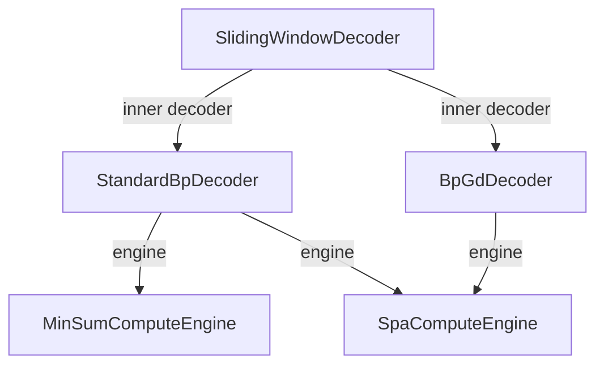

# qldpc-sliding-window-decoding

Rut implementations with Python bindings of a series of decoders for Quantum
Low-Density Parity-Check (QLDPC) Codes, centered around sliding-window
decoding.

## Usage as Python package

```bash
$ pip install .
```

## Development

### Usage

- Set up environment
    ```bash
    $ uv venv --python 3.12
    $ . .venv/bin/activate
    $ uv pip install quits
    ```
- Run unit tests
    ```bash
    $ export LD_LIBRARY_PATH=$(python -c "import sysconfig; print(sysconfig.get_config_var('LIBDIR'))")
    $ cargo test
    ```
- Compile Python library
    ```bash
    $ maturin develop --release
    $ uv run scripts/test_simple_bp.py
    ```

### Profiling

- Generate flamegraph
    ```bash
    $ cargo flamegraph --bin profile_spa
    ```

### Software Architecture

Generic type parameters allow engines to be composed into decoders, and
decoders into other composite decoders.

<div align="center">



</div>


